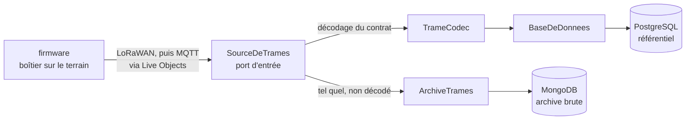
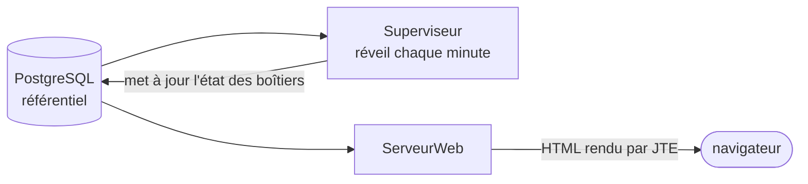

# Supervision des Passive Recorders

Preuve de concept de supervision à distance d'une flotte d'enregistreurs
ultrasonores, par télémétrie LoRaWAN. Projet de SAÉ BUT 3 Informatique,
pour le compte de Samuel Busson, chercheur au CEREMA d'Aix-en-Provence.

## Organisation du dépôt

| Dossier | Rôle | Outil |
|---|---|---|
| `contrat/` | Le contrat de trame et ses vecteurs de test. Source de vérité partagée entre le firmware et le serveur. | Markdown, JSON |
| `trame/` | Bibliothèque Java d'encodage et de décodage de la trame. Aucune dépendance. | Maven |
| `simulateur/` | Génère des trames pour une flotte de boîtiers virtuels et les publie en MQTT. | Maven |
| `backend/` | Ingestion, persistance, supervision, tableau de bord, API. | Maven, Javalin |
| `firmware/` | Module de télémétrie embarquée, testable en natif. | PlatformIO |
| `docs/` | Glossaire, décisions, comptes rendus, dossier de reprise. | Markdown |
| `infra/` | Services locaux pour le développement : PostgreSQL, MongoDB, Mosquitto. | Docker Compose |

Les trois modules Maven sont construits ensemble depuis la racine ;
le firmware a son propre cycle.

## Démarrer

Prérequis : Java 25 et, pour le backend, une base PostgreSQL,
une base MongoDB et un courtier MQTT. `infra/` les fournit si Docker
est disponible ; sinon, installez-les localement et renseignez les
variables d'environnement ci-dessous.

Maven n'a pas à être installé : `./mvnw` (ou `mvnw.cmd` sous Windows)
le télécharge à la première exécution et installe les hooks git du dépôt.

    ./mvnw verify                       # construit, formate-vérifie et teste les trois modules
    cd backend && ../mvnw exec:exec     # lance le serveur sur http://localhost:7070
    cd simulateur && ../mvnw exec:exec  # publie des trames sur le courtier MQTT
    ./mvnw spotless:apply               # reformate le Java (le hook le fait à chaque commit)

## Comprendre la stack

Le système fait une chose : recevoir des trames de télémétrie envoyées
par des boîtiers sur le terrain, et dire lesquels vont bien. Tout le
reste en découle.

### Le chemin d'une trame

**Ingestion** — de l'antenne jusqu'aux bases. Le point important est
la bifurcation : on archive le brut *avant* de décoder quoi que ce soit.

**Restitution** — des bases jusqu'au navigateur.

### Pourquoi ces briques

| Brique | Rôle | Pourquoi celle-là |
|---|---|---|
| Javalin | Serveur HTTP et routage | Tout est explicite : pas d'annotations magiques, la pile d'appel se lit |
| JTE | Gabarits HTML rendus côté serveur | Pas de front séparé à maintenir ; les gabarits sont compilés et typés |
| JDBI | Accès à PostgreSQL | Du SQL écrit à la main, sans ORM qui masque les requêtes |
| Pilote MongoDB | Archive documentaire | Stocke la trame telle qu'elle est arrivée, sans schéma |
| HiveMQ MQTT Client | Abonnement au courtier | Client MQTT moderne, asynchrone, sans dépendance lourde |
| commons-suncalc | Éphémérides | Lever et coucher du soleil, pour savoir quelles sessions étaient attendues |
| JUnit + AssertJ + Testcontainers | Tests | Testcontainers démarre un vrai PostgreSQL : les tests d'intégration ne mentent pas |

Les versions font foi dans les `<properties>` du `pom.xml` racine, pas ici.

### Deux bases, deux rôles

C'est le point qui surprend le plus. Elles ne sont pas redondantes :

- **MongoDB** garde la trame **brute**, telle qu'elle est arrivée, sans
  jamais la décoder. Elle sert à rejouer l'historique, à enquêter sur une
  anomalie, et à tout recalculer si une échelle du contrat se révèle fausse.
- **PostgreSQL** porte le **référentiel** de la campagne : sites, boîtiers,
  déploiements, sessions attendues et constatées. C'est la base qu'on
  interroge pour afficher le tableau de bord.

Si vous décodez avant d'archiver, une erreur de contrat devient
irréversible. C'est pour ça que l'archivage passe en premier.

### Par où entrer dans le code

Dans cet ordre, ça prend une heure :

1. `backend/.../Application.java` — quarante lignes, aucune injection de
   dépendances. Chaque composant y est construit et branché à la main :
   **l'architecture du système se lit dans cette méthode**. C'est
   volontaire, c'est votre plan.
2. `contrat/trame.md` et `contrat/vecteurs.json` — la source de vérité
   partagée entre le firmware et le serveur.
3. `trame/` — la bibliothèque de codage/décodage. Aucune dépendance, des
   tests lisibles : le meilleur endroit pour un premier changement.
4. `docs/decisions/0001-javalin.md` — pourquoi cette pile plutôt que
   Spring Boot.

### Trois pièges qui coûtent une demi-journée

- **Javalin 7 a changé le routage.** Les routes se déclarent dans la
  configuration (`config.routes.get(...)`), plus sur l'application
  (`app.get(...)`). La quasi-totalité des tutoriels en ligne — et les
  réponses des assistants IA — montrent encore l'ancienne forme, qui ne
  compile pas. Voir le guide de migration en ressources.
- **`exec:exec`, pas `exec:java`.** Avec `exec:java`, JTE ne trouve pas
  son runtime au premier rendu et la page d'accueil renvoie 500.
- **Le contrat de trame ne se modifie pas unilatéralement.** Firmware et
  serveur ne divergent jamais sans une révision de `contrat/trame.md`
  *et* des vecteurs de test.

## Configuration du backend

Tout passe par des variables d'environnement, avec des valeurs par
défaut adaptées à `infra/docker-compose.yml`.

| Variable | Défaut |
|---|---|
| `PORT` | `7070` |
| `DB_URL` | `jdbc:postgresql://localhost:5432/supervision` |
| `DB_USER` | `supervision` |
| `DB_PASSWORD` | `supervision` |
| `MONGO_URL` | `mongodb://localhost:27017` |
| `MQTT_HOST` | `localhost` |
| `MQTT_PORT` | `1883` |
| `MQTT_TOPIC` | `simulateur/#` |

## Ressources pour démarrer

Les documentations officielles suffisent : elles sont bonnes, et à jour
des versions utilisées ici. Préférez-les aux tutoriels de blog, souvent
écrits pour des versions antérieures.

**Java et outillage**

- [dev.java — apprendre le langage](https://dev.java/learn/) : records, interfaces scellées, `Optional`, collections
- [Guides Maven](https://maven.apache.org/guides/index.html) : cycle de vie, portées de dépendances
- [Spotless](https://github.com/diffplug/spotless) : le formatage automatique appliqué au commit
- [Docker Compose](https://docs.docker.com/compose/) : pour `infra/`

**Le backend**

- [Documentation Javalin](https://javalin.io/documentation) : la référence, à garder ouverte
- [Migration Javalin 6 → 7](https://javalin.io/migration-guide-javalin-6-to-7) : **à lire avant d'écrire une route**
- [Tutoriels Javalin](https://javalin.io/tutorials/)
- [JTE](https://jte.gg/) : syntaxe des gabarits et paramètres typés

**Persistance**

- [JDBI](https://jdbi.org/) : commencer par le *Core API*, pas par le *SQL Object*
- [Pilote MongoDB Java (sync)](https://www.mongodb.com/docs/drivers/java/sync/current/)

**Réseau et embarqué**

- [HiveMQ MQTT Client](https://hivemq.github.io/hivemq-mqtt-client/) : l'API bloquante suffit au début
- [Mosquitto](https://mosquitto.org/documentation/) : le courtier de `infra/`
- [LoRaWAN expliqué](https://www.thethingsnetwork.org/docs/lorawan/) : portée, cadencement, taille utile — contraintes qui pèsent sur le contrat de trame
- [PlatformIO](https://docs.platformio.org/) : pour `firmware/`

**Tests**

- [JUnit — guide utilisateur](https://docs.junit.org/current/user-guide/)
- [AssertJ](https://assertj.github.io/doc/) : les assertions utilisées ici
- [Testcontainers Java](https://java.testcontainers.org/)
- [commons-suncalc](https://shredzone.org/maven/commons-suncalc/)

## Conventions

Voir `CONTRIBUTING.md`. En deux lignes : une branche par *issue*, une
relecture croisée avant fusion, une CI verte, des commits au format
`type(portée): sujet` en français, et une note de décision pour tout
choix d'architecture.
